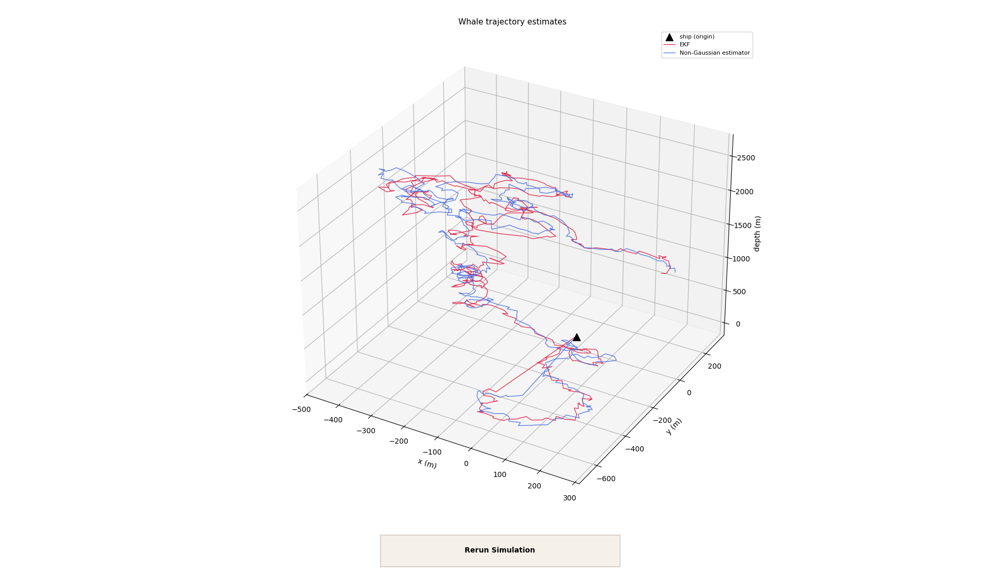
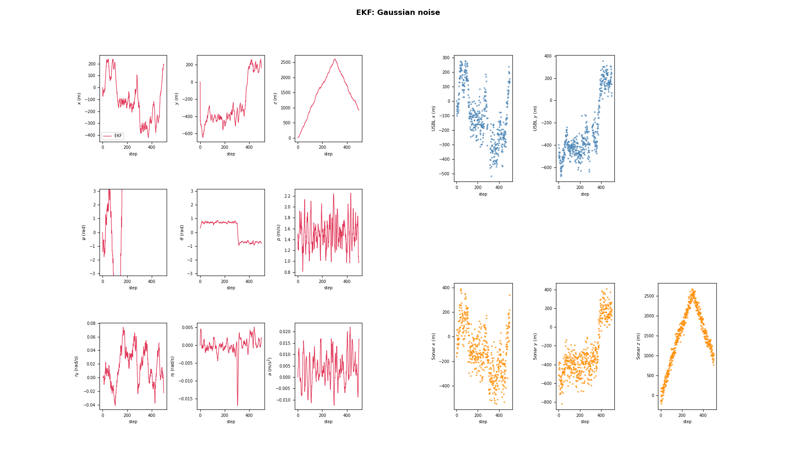
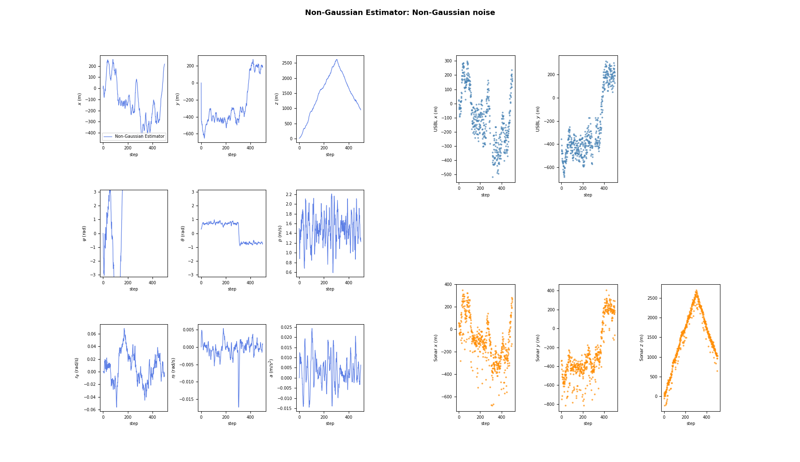

# Recursive Estimation for Whale Tracking

A sensor-fusion project for tracking a Cuvier's beaked whale in 3D using recursive Bayesian estimation. The whale is modeled relative to a stationary research vessel, with measurements provided by a depth-dependent Ultra-Short Baseline (USBL) acoustic system and a noisier active sonar.

This repository contains two estimators:

- an **Extended Kalman Filter (EKF)** for the Gaussian-noise scenario;
- a **Gaussian-mixture-aware recursive estimator** for the non-Gaussian scenario.



## Problem setup

The estimator tracks the nine-dimensional state

$$
\mathbf{x}
=
\begin{bmatrix}
x & y & z & \psi & \theta & p & r_\psi & r_\theta & a
\end{bmatrix}^{\mathsf T},
$$

where:

| State | Meaning | Unit |
|---|---|---|
| $x, y$ | Horizontal position relative to the ship | m |
| $z$ | Depth, positive downwards | m |
| $\psi$ | Yaw angle | rad |
| $\theta$ | Pitch angle | rad |
| $p$ | Forward speed | m/s |
| $r_\psi$ | Yaw rate | rad/s |
| $r_\theta$ | Pitch rate | rad/s |
| $a$ | Forward acceleration | m/s² |

The nonlinear motion model combines the whale's kinematics with a deterministic behavioral model for diving, surfacing, yaw motion, cruising speed, and drag. Unknown maneuvers enter through process noise.

### Sensors

- **USBL acoustic telemetry** measures horizontal position $(x,y)$. Its standard deviation increases linearly with depth,
  $\sigma_U(z)=\sigma_{\text{base}}+\alpha z$, and the sensor drops out completely below the configured depth threshold. Missing measurements are represented by `np.nan`.
- **Active sonar** measures the full position $(x,y,z)$. It remains available at depth but is substantially noisier.

The simulator provides two scenarios with equal noise means and variances:

1. Gaussian process and measurement noise.
2. Uniform process/USBL noise and asymmetric bimodal Gaussian-mixture sonar noise.

## Estimation methods

### Extended Kalman Filter

The EKF uses:

- the nonlinear nine-state motion model for prediction;
- an analytical state-transition Jacobian;
- depth-dependent USBL covariance evaluated at the predicted depth;
- dynamic measurement matrices that omit unavailable USBL channels;
- a standard innovation-based Kalman update; and
- covariance symmetrization after prediction and correction.

### Non-Gaussian estimator

The second estimator preserves the recursive Gaussian prior but treats every available sonar channel as a two-component asymmetric Gaussian mixture. At each update it:

1. enumerates the possible sonar mixture assignments (at most $2^3=8$);
2. computes the likelihood and posterior mean of each component;
3. normalizes the component weights; and
4. collapses the mixture back to a single mean and covariance by moment matching.

This keeps the public estimator interface lightweight while explicitly accounting for the sonar distribution's dominant and outlier modes.

## Example results

The committed `results.npz` contains a representative 500-step simulation. Because the simulation is stochastic, values will change between runs.

| State | EKF RMSE<br>Gaussian noise | Non-Gaussian estimator RMSE<br>Non-Gaussian noise |
|---|---:|---:|
| $x$ (m) | 37.359 | 26.621 |
| $y$ (m) | 42.819 | 26.712 |
| $z$ (m) | 32.511 | 20.481 |
| $\psi$ (rad) | 1.483 | 1.092 |
| $\theta$ (rad) | 0.220 | 0.218 |
| $p$ (m/s) | 0.489 | 0.436 |
| $r_\psi$ (rad/s) | 0.0339 | 0.0214 |
| $r_\theta$ (rad/s) | 0.00509 | 0.00485 |
| $a$ (m/s²) | 0.0124 | 0.0104 |

| Estimator | Average time per update | Timing score |
|---|---:|---:|
| EKF | 1.30 ms | 0.994 |
| Non-Gaussian estimator | 4.42 ms | 0.998 |

### EKF under Gaussian noise



### Mixture-aware estimator under non-Gaussian noise



## Running the project

### Requirements

- [Docker Desktop](https://www.docker.com/products/docker-desktop/)
- Python 3.8 or newer for displaying the interactive plots on the host

The Docker image uses Python 3.10, NumPy 1.25.2, and Matplotlib 3.10.0. The launchers constrain the container to the same four-CPU, 2 GB memory environment used for the exercise.

### Windows

```bat
run.bat
```

### macOS or Linux

```bash
bash run.sh
```

On the first run, the launcher builds the `re-student` Docker image. It then runs the simulation and both estimators, saves the data to `results.npz`, prepares a local plotting environment, and opens three interactive figures.

Use the **Rerun Simulation** button in the 3D figure to execute the pipeline again without restarting the launcher.

### Headless mode

For a non-interactive run:

```bat
run.bat headless
```

or:

```bash
bash run.sh headless
```

Headless mode writes `results.npz` together with `plot_3d.png`, `plot_ekf.png`, and `plot_nge.png`.

## Repository structure

| Path | Purpose |
|---|---|
| `estimator.py` | EKF and non-Gaussian estimator implementations |
| `const.py` | Initial-state, process, sensor, motion, and timing constants |
| `run.py` | Simulation, estimator execution, scoring, and result export |
| `run.bat`, `run.sh` | Cross-platform Docker launchers |
| `simulator.py` | Obfuscated whale-motion and sensor simulator |
| `pyarmor_runtime_000000/` | Runtime required by the obfuscated simulator |
| `scoring.py` | Angular-aware RMSE and timing-score utilities |
| `plot_results.py` | Loads saved results and opens interactive figures |
| `plotting.py` | Trajectory, state, and measurement plotting helpers |
| `Dockerfile`, `entrypoint.sh` | Reproducible container environment |
| `requirements.txt` | Python dependencies |
| `results.npz` | Saved estimates, measurements, RMSEs, and timings |
| `Figure_1.png` | Combined 3D trajectory visualization |
| `Figure_2.png` | EKF state and measurement visualization |
| `Figure_3.png` | Non-Gaussian estimator visualization |
| `RE_2026_ProgEx_Instructions.pdf` | Original programming-exercise brief |

## Course context

This project was completed for **151-0566-00 Recursive Estimation, ETH Zurich, Spring 2026**. The repository documents the completed exercise; students working on related coursework should follow their institution's academic-integrity requirements.
